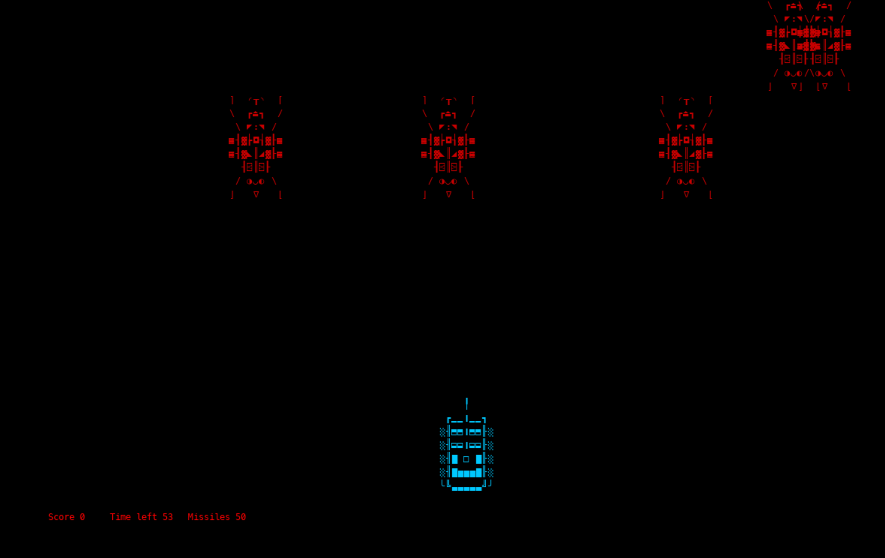

# Code Combat: ASCII Strikes Back

Welcome to Code Combat: ASCII Strikes Back! 

In "Code Combat: ASCII Strikes Back," players wield the ASCII Cannon to fend off waves of pesky bugs threatening the digital realm.

This readme file will guide you through the steps to run the project successfully on your local machine.

## Option 1: Running the program as an executable

To run the program as an executable, follow these simple steps:

1. **Download and Extract**: Download the `code_combat.zip` from the repository. Once downloaded, extract the contents of the zip file to a location of your choice on your computer.

2. **Locate the Executable**: Navigate to the `build/code_combat` directory within the extracted folder.

3. **Run the Executable**: Double-click the `code_combat.exe` file to launch the program.

## Option 2: Building and running the program from source

### Prerequisites

Before you begin, ensure you have the following installed on your system:
- [Python](https://www.python.org/downloads/) (version 3.6 or later)
- [Pygame](https://www.pygame.org/download.shtml) library

### Installation

1. Clone the repository to your local machine using the following command:

       git clone https://github.com/Adamgtay/Code-Combat-ASCII-Strikes-Back.git

2. Navigate to the project directory:

       cd Code-Combat-ASCII-Strikes-Back/src

### Installing Python and Pygame

#### Installing Python

If you don't have Python installed on your system, you can download it from the official Python website:
[Python Downloads](https://www.python.org/downloads/)

Follow the installation instructions provided on the website for your specific operating system.

#### Installing Pygame

Once Python is installed, you can install Pygame using pip, the Python package manager. Open a terminal or command prompt window and run the following command:

    pip install pygame

This will download and install the Pygame library and its dependencies.

### Running the Project

To run the Pygame project, follow these steps:

1. Open a terminal or command prompt window.

2. Navigate to the project directory if you're not already there.

3. Run the main Python file of the project using the following command:

       python3 code_combat.py

### Controls

Once the project is running, you can control the game using the following keys:

- Movement: UP, DOWN, LEFT, RIGHT arrows
- Fire Weapon: SPACE
- Quit: Q

## Additional Notes

All graphics and sounds © Adam Taylor.

---

Thank you for trying out Code Combat: ASCII Strikes Back! If you encounter any issues or have any feedback, feel free to open an issue on GitHub or contact me directly. Have fun playing the game!
